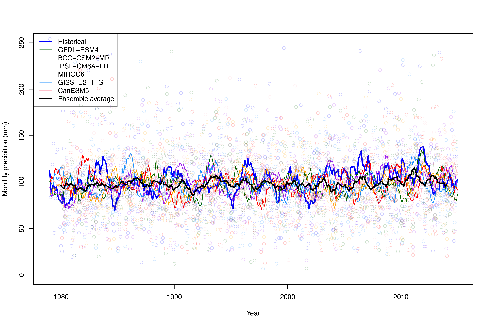
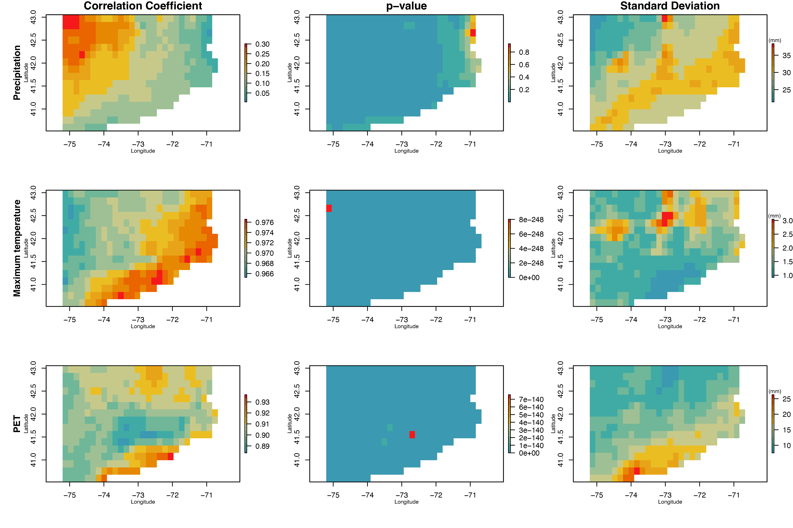

# SPEI_CMIP6

Code for Yale 2024 Senior Thesis in Earth and Planetary Sciences "**Into Arid Unknowns: Projecting Drought Over the Northeastern United States Using NEX-GDDP-CMIP6"**

					

				

			

		

	
